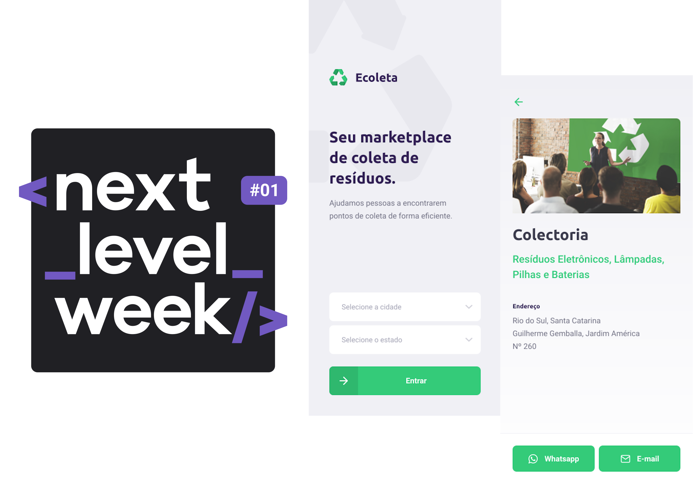
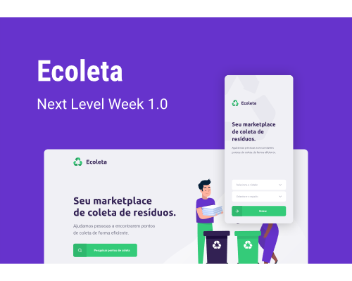

<h1 align="center">
  
</h1>

<h2>
  Next Level Week #01 - Ecoleta - Alternative Server C#
</h2>

<p align="center">
  <a href="https://www.linkedin.com/in/leonardo-panichi-504022117/">
    
  </a>

  <a href="https://github.com/LeoPanichi/rocketseat-nlw-01/commits/master">
    
  </a>

  
   <a href="https://github.com/LeoPanichi/rocketseat-nlw-01/stargazers">
    
  </a>
</p>

<p align="center">
  <a href="#-next-level-week">Next Level Week</a>&nbsp;&nbsp;&nbsp;-&nbsp;&nbsp;&nbsp;
  <a href="#-project">Project</a>&nbsp;&nbsp;&nbsp;-&nbsp;&nbsp;&nbsp;
  <a href="#-Technologies">Technologies</a>&nbsp;&nbsp;&nbsp;-&nbsp;&nbsp;&nbsp;
  <a href="#-layout">Layout</a>&nbsp;&nbsp;&nbsp;-&nbsp;&nbsp;&nbsp;
  <a href="#-how-to-use">How to install and run</a>&nbsp;&nbsp;&nbsp;-&nbsp;&nbsp;&nbsp;
  <a href="#-license">License</a>
</p>

# 💭 Next Level Week?

Next Level Week is a technology week focused on learning web development using the latest technologies in the job market.

## 🖥 Project 

Ecoleta is a project developed based on international environment week. 
That aims to connect people to companies that collect specific waste such as light bulbs, batteries, cooking oil, etc.

<h1 align="center">
  
</h1>

## 🛠 Technologies

This project was developed with the following technologies:

- [C#][c-sharp]
- [.Net Core][dotnetcore]
- [Docker][docker]
- [MSSQL Server][mssqlserver]

## 📐 Layout

To access the layout of the project use [Figma](https://www.figma.com/file/1SxgOMojOB2zYT0Mdk28lB/).

## ℹ️ How To Use

To clone and run this application, you'll need [Git](https://git-scm.com), [.NET Core][dotnetcore] and [Docker][docker] installed on your computer.

From your command line:

### Run MSSQL Server from Docker

```bash
# Clone this repository
$ git clone https://github.com/LeoPanichi/rocketseat-nlw-01-server-alt1


# Go into the repository
$ cd rocketseat-nlw-01-server-alt1/server/Docker

# Install dependencies
$ docker-compose up -d

# running on port 1433
```

### Install API Server

```bash
# Clone this repository (If not already cloned)
$ git clone https://github.com/LeoPanichi/rocketseat-nlw-01-server-alt1


# Go into the repository
$ cd rocketseat-nlw-01-server-alt1/server

# Install dependencies
$ dotnet build

# Install dotnet-ef tool
$ dotnet tool install --global dotnet-ef

# Run Migrates & Seeds
$ dotnet ef database update

# Start server
$ dotnet run

# running on port 3333
```

## 📝 License

This project is under the MIT license. See the [LICENSE](https://github.com/LeoPanichi/rocketseat-nlw-01-server-alt1/blob/master/LICENSE) for details.


Made by Leonardo Panichi
[Linkedin](https://www.linkedin.com/in/leonardo-panichi-504022117/)

[c-sharp]: https://dotnet.microsoft.com/en-us/languages/csharp
[dotnetcore]: https://dotnet.microsoft.com/pt-br/download
[docker]: https://www.docker.com/
[mssqlserver]: https://www.microsoft.com/pt-br/sql-server/sql-server-downloads
